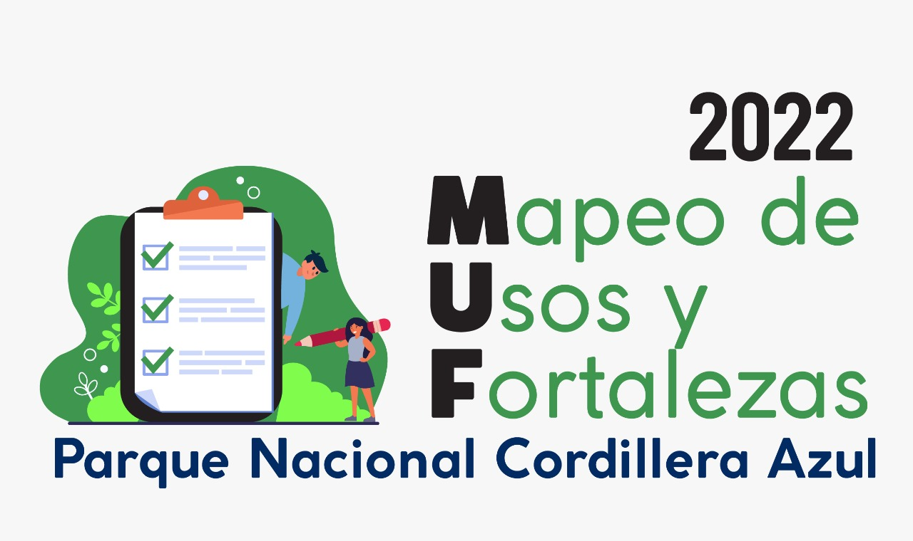

# MUF | FORMS APPLICATION




**Requerimientos**

`Nota: Necesitas tener un Hosting Compartido y tener comprado SSL para poder correr la App.`

- PHP 7.4
- Node.js 16.17.1
- MySQL
- Certificado SSL

**Instalación**

Para correr la app, puedes hacerla de dos formas el cual es: 

- Testeo
- Build

### Desplegar App.

----------
Necesitas clonar el [repositorio](https://github.com/ZannTech/muf-api) de la Api Rest el cual vas a conectar.

Necesitas correr el siguiente comando en tu terminal:

```cmd
    ipconfig
```

Pones tu IP Local el cual está en el resultado como **Dirección IPv4.**

Ahora al clonar la api key pones: 

```
    php artisan serve --host=tuipv4

```

Ahora vas al codigo de la app movil, vas a:
`src/api/config.jsx` y reemplazas por esto:

```javascript
    export const ConfigClient = {
        api: {
            testing: 'tuservidorlocal',
            produccion: 'produccion'
        }
    }
```
Al final, vas a `src/api/client.jsx` y cambias la constante dependiendo del modo de producción que desées.